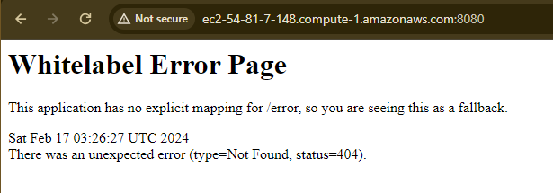

# UNDERSTANDING MAVEN: BUILDING A SIMPLE SPRING BOOT JAVA PROJECT


*This project demonstrates the creation of a simple Spring Boot Java project using Maven. It starts with generating project structure via Spring Initializr. Then, it guides through creating Java source code. Next, it involves setting up an EC2 instance on AWS and connecting via MobaXterm. Configurations are done to ensure Maven works, followed by verifying Maven by compiling and building the Java code on EC2. This hands-on project provides practical insights into Maven, AWS setup, and Java project management in a cloud environment.*


# Learning Outcomes

  - Gain proficiency in setting up a Spring Boot Java project using Maven.
  - Understand the process of generating project structure with Spring Initializr.
  - Learn to write and manage Java source code within a Spring Boot project.
  - Acquire skills in setting up and configuring an EC2 instance on AWS.
  - Develop competency in connecting to an EC2 instance using MobaXterm.
  - Learn to install and configure Maven on an EC2 instance.
  - Practice compiling and building Java code using Maven on a remote server.
  - Gain insights into cloud-based development workflows and infrastructure management.
  - Enhance problem-solving skills by troubleshooting and resolving configuration issues.
  - Develop a deeper understanding of software development best practices within a cloud environment.

# Prerequisites 


  - `Basic` understanding of Java programming language. 
  - Familiarity with `Spring Boot framework` concepts (e.g., dependency injection, annotations).
  - Basic understanding of `Maven` build tool and its usage.
  - Knowledge of `AWS services` and basic familiarity with the AWS Management Console.
  - Understanding of `remote server access` concepts (e.g., `SSH`).
  - Basic familiarity with `terminal/command line interfaces`.
  - Access to an AWS account with `permissions` to create and manage EC2 instances.
  - Installation of `MobaXterm ` or equivalent `SSH client for remote server access`.
  - Familiarity with software development concepts such as `compiling`, `building`, and `configuring` applications.

# MAVEN Introduction


Maven is a powerful build automation tool primarily used for Java projects, although it can be used to manage projects in other programming languages as well. It simplifies the process of building and managing projects by providing a standard way to define project structure, dependencies, and build process. Maven uses a project object model (POM) file to define project configurations and dependencies.


# LET'S START

# STEP1 : Generate Project Structure

Utilize Spring Initializr to generate the initial structure for the Spring Boot Java project with Maven.

- Go to https://start.spring.io/ 
- Choose the options like in the picture1;
  - Project: Maven
  - Spring Boot : 3.2.2
  - Name: Give a name for your artifacts
  - Packaging : Jar
  - Language : Java


  - Add `Spring Web` and `Spring Reactive Web ` dependencies.


  - And (generate) download it to your computer.


- After downloading the zip file create a `project folder` and extract inside of the folder.
- It will look like following image. 


- Now we have `java project` source code. Let's start configuring other environments.


# STEP2: Download MobaXterm

What is MobaXterm and why we use it? 

MobaXterm is a versatile and popular terminal emulator and remote desktop client for Windows. It integrates essential tools like SSH, X11 server, RDP, and file transfer capabilities into a single application, making it convenient for developers, system administrators, and IT professionals to manage remote servers and perform system administration tasks from their Windows machines. It's widely used for its intuitive interface, extensive feature set, and ease of use, offering a seamless experience for accessing and controlling remote systems efficiently.

- Go to https://mobaxterm.mobatek.net/download.html and choose `Free Version` and download the `MobaXterm Home Edition v23.6 (Portable Edition)` zip file and extract it. 

- You will see the `personal exe` file just clock it, it will just open immidiately. 


*Note: If you are using other tools (ex; VSCode ) to connect remote machines it is fine to use your tool. I just want to show you a different tool to make familiar with other options.*

# STEP3: Create an EC2 instance 

- Go to AWS EC2 console.
- First we need to create a security group it allows us to connect with SSH ``22 and allows TCP connection port on `8080`
- Go to `Security Groups` and create one with inboud rules allows to ssh `22` and custom tcp `8080`


- Go back to `Instances`
- Click `Launch intances` give a name you want.
- Choose Ubuntu AMI : `Ubuntu Server 20.04 LTS (HVM), SSD Volume Type` 

 

- Instance Type: `t2.micro`
- Key Pair : You should have a key-pair on your local, if you don't have create one. I choose existing one `awssinem`. 


- Leave all the rest of configuration as is.

#  STEP4: Connect to EC2 Instance via MobaXterm

- Copy the `Public IP` of your EC2-Instance.
- Go to your MobaXterm click `start local terminal` and session screen will be pop up.
- Go to first tab on the screen called `Session` and new screen will pop up
- Click the `SSH` 
- For 
- Remote Host : Paste your `Public IP`
- Specify username: `ubuntu` make sure you write ubuntu otherwise it will give `error`
- Click `Advanced SSH setting` and click `Use Private Key` and find your `key-pair` which you use for create your ec2 instance and upload your key to MobaXterm. And Click `OK`
- You can see following; 


- You should see the connection is successfully achieved. 


# STEP5: Configure Your Ec2 Instance


- We need to make sure our EC2 instance is currently fully updated.
- Before we run our codes following we need to change to root account. 

```bash
sudo su
```

- Output should look like this; 


-We need to run following commands for making sure that all Ubuntu OS packages installed on the server are up to date. You can do this by running the following commands:

```bash
apt-get update -y
apt-get upgrade -y
```
- Now we need to upload the `java` to our machine and the version should match the java version of Maven Project that we created with `springboot`.

- Ubuntu 20.04’s default repository included Java 17. This is the easiest way to install the JDK using the apt package manager:

```bash
apt install openjdk-17-jdk openjdk-17-jre -y
```

- Once installed, verify the Java version using the following command:

```bash
java -version
```


- You should get the following output:


- We need to upload  `Maven` as well.


```bash
apt-get install maven -y
```

- Check the version of maven

```bash
mvn -version
```

- Output should look like this;


- Now we need to upload project file to `Github`

- First go to Github.com and create a `Public` - `repository` and go to file that you store the Maven Project files in your local directory.

- In this project my repo name is [simple-maven-springboot-prohect)](https://github.com/sinemozturk/simple-maven-springboot-prohect)

- Go to gitbash terminal of your choice (ex: VSCODE, Gitbash) I will use VSCODE bash terminal

- Run following commands;

```bash
git init
git add .
git commit -m "first commit"
git branch -M main
git remote add origin https://github.com/sinemozturk/simple-maven-springboot-prohect.git
git push -u origin main
```


- Go back to your repository that you created and refresh it you will be able to see your project files.

- Go to `<Code>` button and copy the `HTTPS` url of your Github reporsitory 


- Now go back to your `MobaXterm` terminal and run following command, It will clone your repository to your EC2-instance. 

```bash
git clone https://github.com/sinemozturk/simple-maven-springboot-prohect.git
```

- You can run `ls` to see if it is succesfully uploaded or not. 


- Now we need to go into the file that we created with Springboot which we stored in our Github Repo with `cd` command.

```bash
cd << paste your repo name>>
ls
cd <<paste your project name>> 
```


- We will be able to see our `Maven Project` files.

# STEP6: Run Maven Commands

- Now we can start with running our `Maven` commands in the order of this project.

```bash
mvn validate
```

Maven validate : Maven is used to validate the project configuration and ensure that it is correct and all necessary information is available. This command is often used to check for basic errors in the project setup before proceeding with the build process.

When you run mvn validate, Maven will perform the following tasks:

  - Validates the project structure: It checks if the project directory structure adheres to the Maven standard, such as the presence of src/main/java for source code and src/test/java for test code.

  - Validates the project object model (POM): It verifies that the pom.xml file is well-formed and does not contain any syntax errors.

  - Resolves project dependencies: It checks if all declared dependencies in the pom.xml file can be resolved from the configured repositories.

- You should see following output;


```bash
mvn compile
```

Maven Compile: The mvn compile command in Maven is used to compile the source code of the project. When you run mvn compile, Maven will:

   - Compile the Java source code located in the src/main/java directory.
   - Generate compiled bytecode (.class files) from the Java source files.
   - Place the compiled classes in the `target/classes directory` within the project's build directory.

- You should see following output with a directory called `target` which is created with compile;


- You can also go inside the  `target` directory and see what it is inside with `ls` command. But do not forget to go back to your project file path with `cd ..`


```bash
mvn test
```

Maven Test: Runs the tests for the project.

The mvn test command in Maven is used to execute the tests defined in the project. When you run mvn test, Maven will:

  - Compile the project's source code, including test source code located in the src/test/java directory.
  - Run the tests using a testing framework such as JUnit or TestNG.
  - Report the results of the tests, including information about passed, failed, or skipped tests.


- You should see the output like this;


```bash
mvn package
```

Maven Package: Packages the compiled code into a distributable format, such as a JAR or WAR file.

  - Compile the project's source code, if it has not already been compiled.
  - Execute any necessary build tasks specified in the project configuration.
  - Package the compiled classes, along with any additional resources (such as configuration files libraries, and static assets), into a distributable archive format.
  - Place the resulting package in the target directory within the project's build directory.

- Also you can see the attifact is generated with package command. But make sure go back to your project path with `cd ..` command


```bash
mvn install
```

Maven Install :  Installs the packaged artifact into the local Maven repository, making it available for other projects.

  - Compile the project's source code, if it has not already been compiled.
  - Execute any necessary build tasks specified in the project configuration.
  - Package the compiled classes, along with any additional resources, into a distributable archive format (JAR, WAR, etc.).
  - Install the packaged artifact into the local Maven repository (~/.m2/repository), making it available for use by other projects or modules on the same machine.

- You should see the output like this;


```bash
mvn clean
```

Maven clean: This command solely cleans the project by removing any generated files and directories created during the build process. It deletes the target directory and any other temporary files generated during the build. However, it does not perform any build or packaging actions.


```bash
mvn clean package
```

Maven clean package: This command cleans the project first, just like mvn clean, by deleting the target directory. After cleaning, it proceeds to execute the package phase of the Maven build lifecycle. This includes compiling the source code, executing tests, and packaging the compiled classes and resources into a distributable archive (e.g., JAR, WAR).


```bash
java -jar target/ <<your jar file name>>
```

- Int this project my jar file called as :  `sinemsproject-0.0.1-SNAPSHOT.jar` and my command was `java -jar target/sinemsproject-0.0.1-SNAPSHOT.jar`

The java -jar command is used to execute a Java application packaged as a standalone JAR (Java ARchive) file. Here's how it works:

  - java: This command is used to launch the Java Virtual Machine (JVM), which is the runtime environment for running Java applications.

  - -jar: This flag specifies that the next argument should be the path to a JAR file. When used in conjunction with java, it tells the JVM to execute the main class specified in the JAR's manifest file.


- You should see output like this;


- Now our project is running on port:8080 go back to your AWS Console and copy Publib IP of your Ec2 instance. 

- Go to your browser -> paste it also make sure you add :8080 at the end of your public ip. Also make sure you connect with `http` not with `https` because https port (443) is different than http(8080). We only allowed 8080

```
http://<<your public IP>>:8080

```

- You should see the `Whitelabel Error Page` like following;




- The reason is we did not configure the java project to solve this problem we need to go back to our source code path is ->

src/
└── main/
    └── java/
        └── com/
            └── example/ 
                └── <<yourprojectfilename>>/
                    └── HomeController.java 
                    └── <<yourprojectfilename.java>>

- We need to create a controller that handles requests to the root URL ("/") and returns the desired message. Here's how you can achieve this:

- Create a new Java `class` for your controller called by `HomeController.java`:

- You can simply achieve this one with creating  HomeController.java file under the your project file. It will locate like this - > 
 src/main/java/com/example/<<yourprojectfilename>>

- Copy and modify the file name in the code and add into the HomeController.java


```java

package com.example.<<yourprojectfilename>>;

import org.springframework.stereotype.Controller;
import org.springframework.web.bind.annotation.GetMapping;
import org.springframework.web.bind.annotation.ResponseBody;

@Controller
public class HomeController {

    @GetMapping("/")
    @ResponseBody
    public String home() {
        return "Hi from this project";
    }
}

```

- Now we will add `Html` and `Css` file to see little pretier look.

- You can create an HTML file (e.g., `index.html`) in the src/main/resources/static directory. This HTML file can contain the text "hi from this project" or any other content you want to display.


```html
<!DOCTYPE html>
<html lang="en">
<head>
    <meta charset="UTF-8">
    <title>Greetings</title>
    <link rel="stylesheet" href="styles.css"> <!-- Reference to CSS file -->
</head>
<body>
    <h1>Hi from this project</h1>
</body>
</html>

```

- If you want to style your HTML content, you can create a CSS file (e.g., `styles.css`) in the src/main/resources/static directory and reference it from your HTML file.

```css
body {
    font-family: Arial, sans-serif;
    background-color: #f0f0f0;
}

h1 {
    color: blue;
}

```

- Now we need to push the project to the github repo to update our source code

- Go to gitbash terminal of your choice (ex: VSCODE, Gitbash) I will use VSCODE bash terminal

- Run following commands;

```bash
git add .
git commit - m "Java files are updated"
git push -u origin main

```

- Now go to your MobaXterm and press the Ctrl+C to stop running the jar command that we run previously. 

- First thing we need to update our source code with new changes that we made and store in gitgub repo. 

- run following command to update your ec2 instance make sure that you're under the project folder file path. 

```bash
git pull origin main
```

- Output should look like this; 


  - This command instructs Git to pull changes from the "main" branch of the remote repository named "origin" and merge them into your current local branch.

- Now we can start building our app again. Execute following codes separately;


```bash
mvn clean
mvn compile
mvn test
mvn package
java -jar <your-jar-file>.jar

```


- Go to your browser and apply following command with your public IP

```text
http://<<your public IP>>:8080

```

- You will see something like; 


- To see something cool go to following address; 

```text
http://<<your public IP>>:8080/index.html

```

- You should see something cool like this;


# Conclusion

Congratulations on completing the setup of your Spring Boot project! 🎉 This project serves as a testament to your dedication and perseverance in learning new technologies and building practical applications. Remember that every challenge you faced and overcame during this project has contributed to your growth as a developer.

As you continue your journey, embrace every opportunity to explore, experiment, and innovate. Stay curious, stay passionate, and never hesitate to reach out for help or guidance when needed. Your commitment to learning and improvement will pave the way for countless more successful projects in the future.

Keep coding, keep creating, and keep pushing the boundaries of what you can achieve. The possibilities are endless, and your potential knows no bounds. Believe in yourself, trust in your abilities, and never forget that with determination and effort, anything is possible.

Best of luck on your coding adventures! 💻✨

